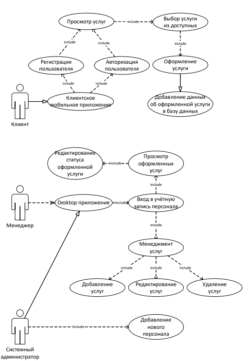

# Курсовой проект по теме "Автосервис"
## Описание предметной области
Наша компания занимается по предоставлению ремонтных  услуг транспортных средств.
В настоящее время отрасль автосервиса является одной из самых динамично развивающихся в мире. С каждым годом все больше людей обращаются за помощью в ремонте своих автомобилей, а также производят регулярное техническое обслуживание. Это создает потребность в эффективных и инновационных решениях для автосервисов.
Разработка приложения, которое будет представлять собой автосервисную информационную систему, имеет большой потенциал для улучшения качества обслуживания, повышения удобства работы и улучшения технических возможностей. 
Курсовой проект по программированию на информационную область "Автосервис" будет направлен на изучение и разработку такой системы. Ключевые задачи проекта будут включать в себя создание удобного интерфейса для пользователей, управления информационной базой, удобной системы поиска и оформления заказов, а также многочисленных других функций, необходимых для обеспечения полноценной работы автосервиса.
Целью этого проекта будет создание эффективной системы автосервиса, которая позволит упростить процессы ремонта и технического обслуживания автомобилей, ускорить временные рамки на обслуживание клиентов и улучшить уровень сервиса. Будет использоваться современные технологии программирования, анализа и управления данными, чтобы обеспечить высокую эффективность приложения и удовлетворить потребности клиентов.

Реализация услуги выглядит так: 

 1. Клиент  регистрируется или авторизуется в пользовательском приложении. 
 2. Клиент смотрит список доступных услуг.
 3. Клиент выбирает необходимую ему услугу из доступных.
 4. Клиент переходит к оформлению выбранной услуги.
 5. Клиенту предоставляется информация: 
	* Название услуги.
	* Средняя цена за услугу.
	* Описание что входит в услугу.
6. Клиент оформляет услугу.
7. Информация о оформлении услуги добавляется в систему.
8. Оформленные услуги видят сотрудники компании через программу на компьютере.
9. Клиент может отказаться от услуги.

## Небольшая статистика за 2021 г.
| Услуга | Общая цена р. | Количество|
|--|--|--|
| Пере обувка резины | 300000 | 200 |
| Диагностика автомобиля | 60000 | 342 |
| Ремонтные услуги | 500000 | 942 |
# USE-CASE

 

# ERR
Для курсового проекта была создана база данных.

| Имя  | Тип данных |
| ------------- | ------------- |
| Login  | varchar(256)  |
| Password  | varchar(256)  |
| FirstName  | varchar(256)  |
| LastName  | varchar(256)  |
| UsedServiceID  | int  |
| Machine name   | varchar(256)  |
| Machine brand  | varchar(256)  |
| Year of issue  | Date  |
| Machine brand  | varchar(256)  |
| Machine mileage  | Date  |
| The model of car | varchar(256)  |

## SplashScreen
При открытии приложения клиенту будет показан splash screen.
	
](http://example.com/)
	
	
	
