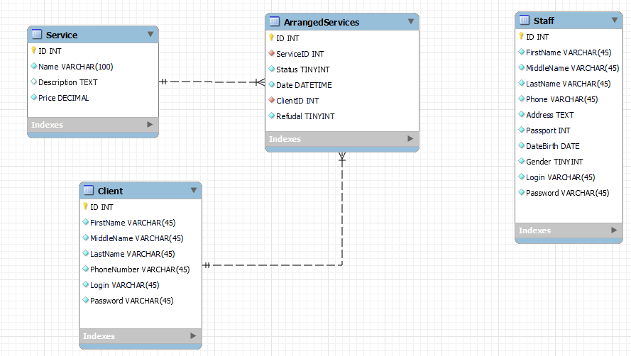

# EER
Модели базы данных находятся в файле EER.mwb

| Service |             |             |                 |
|---------|-------------|-------------|-----------------|
| Ключ    | Имя         | Тип данных  | Описание        |
| Y       | ID          | INT         | Первичный ключ  |
|         | Name        | VARCHAR(45) | Название услуги |
|         | Description | TEXT        | Описание услуги |
|         | Price       | DESIMAL     | Цена услуги     |

| ArrangedServices |           |            |                                |
|------------------|-----------|------------|--------------------------------|
| Ключ             | Имя       | Тип данных | Описание                       |
| Y                | ID        | INT        | Первичный ключ                 |
|                  | ServiceID | INT        | ID из таблицы Service          |
|                  | Status    | TINYINT    | Статус (Выполнено/Выполняется) |
|                  | Date      | DATETIME   | Дата оформления                |
|                  | ClientID  | INT        | ID из таблицы Client           |
|                  | Refudal   | TINYINT    | Отказ от услуги                |

| Staff |            |             |                      |
|-------|------------|-------------|----------------------|
| Ключ  | Имя        | Тип данных  | Описание             |
| Y     | ID         | INT         | Первичный ключ       |
|       | FirstName  | VARCHAR(45) | Имя                  |
|       | MiddleName | VARCHAR(45) | Отчество             |
|       | LastName   | VARCHAR(45) | Фамилия              |
|       | Phone      | VARCHAR(45) | Номер телефона       |
|       | Address    | TEXT        | Адрес проживания     |
|       | Passport   | INT         | Серия номер паспорта |
|       | DateBirth  | DATE        | Дата рождения        |
|       | Gender     | TINYINT     | Пол                  |
|       | Login      | VARCHAR(45) | Логин                |
|       | Password   | VARCHAR(45) | Пароль               |

| Client |             |             |                                |
|--------|-------------|-------------|--------------------------------|
| Ключ   | Имя         | Тип данных  | Описание                       |
| Y      | ID          | INT         | ID из таблицы ArrangedServices |
|        | FirstName   | VARCHAR(45) | Имя                            |
|        | MiddleName  | VARCHAR(45) | Отчество                       |
|        | LastName    | VARCHAR(45) | Фамилия                        |
|        | PhoneNumber | VARCHAR(45) | Номер телефона                 |
|        | Login       | VARCHAR(45) | Логин                          |
|        | Password    | VARCHAR(45) | Пароль                         |

 

	
	
	
	
	
